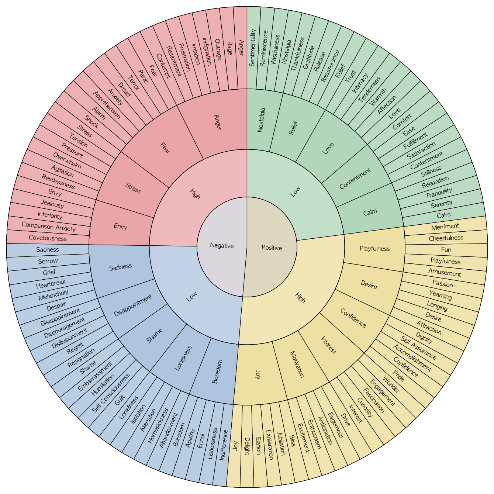

# Emotion Wheel 1 Guide

This document explains every leaf emotion in `english_emotion_wheel_1` with one concise descriptive sentence.

## Negative Valence / High Arousal

### Anger
- `anger`: A direct feeling that something wrong or obstructive should be confronted.
- `rage`: Explosive anger that feels intense and hard to contain.
- `outrage`: Anger sparked by something seen as deeply unacceptable.
- `indignation`: Moral anger at unfair, insulting, or unjust treatment.
- `irritation`: Lower-intensity anger caused by repeated annoyance or friction.
- `frustration`: Anger that grows when you are blocked from what you want or need.
- `resentment`: Lingering anger tied to hurt, unfairness, or unresolved grievance.
- `contempt`: Cold anger that looks down on the other person.

### Fear
- `fear`: A basic feeling that something dangerous may happen.
- `panic`: Sudden overwhelming fear that floods the body and mind.
- `terror`: Extreme fear that feels overpowering and urgent.
- `dread`: Heavy fear of something bad that seems likely to come.
- `anxiety`: Ongoing fear mixed with uncertainty and mental tension.
- `apprehension`: Cautious fear before a possible threat or challenge.
- `alarm`: A sharp fear response when danger feels immediate.
- `shock`: Stunned distress after something frightening or abrupt.

### Stress
- `stress`: Overall strain when demands feel greater than your capacity.
- `tension`: Tight mental or physical pressure that keeps you on edge.
- `pressure`: Feeling pushed by expectations, deadlines, or consequences.
- `overwhelm`: Feeling flooded by more than you can handle at once.
- `agitation`: Restless, keyed-up distress that makes it hard to settle.
- `restlessness`: Uneasy inability to relax or stay still.

### Envy
- `envy`: Pain at seeing something good that someone else has.
- `jealousy`: Fear or anger about losing attention, affection, or status.
- `inferiority`: Feeling smaller or less capable than others.
- `comparison anxiety`: Unease that grows when you measure yourself against other people.
- `covetousness`: Strong desire to possess what belongs to someone else.

## Negative Valence / Low Arousal

### Sadness
- `sadness`: A broad feeling of emotional pain or loss.
- `sorrow`: Deep sadness that feels heavy and tender.
- `grief`: Intense sadness after a major loss.
- `heartbreak`: Sharp emotional pain from separation, rejection, or disappointment.
- `melancholy`: Quiet, lingering sadness with a reflective tone.
- `despair`: Sadness that feels almost empty of hope.

### Disappointment
- `disappointment`: Pain when reality falls short of hope.
- `discouragement`: Loss of confidence or motivation after setbacks.
- `disillusionment`: Sadness and frustration when something once trusted feels false.
- `regret`: Pain about a choice you wish had been different.
- `resignation`: Giving up hope of change and accepting an unwanted outcome.

### Shame
- `shame`: Painful sense that something about you feels wrong or exposed.
- `embarrassment`: Social discomfort after awkward attention or a mistake.
- `humiliation`: Shame caused by being demeaned or lowered in front of others.
- `self-consciousness`: Uncomfortable awareness of how you may be seen by others.
- `guilt`: Pain from believing you did something wrong.

### Loneliness
- `loneliness`: Painful sense of missing meaningful connection.
- `isolation`: Feeling cut off from people or support.
- `alienation`: Feeling distant from others, a group, or even yourself.
- `homesickness`: Loneliness tied to missing home or familiar people.
- `abandonment`: Painful feeling of being left behind or not chosen.

### Boredom
- `boredom`: Discomfort from lack of interest or stimulation.
- `apathy`: Flat lack of caring or emotional engagement.
- `ennui`: Weary boredom that feels drained and directionless.
- `listlessness`: Low-energy boredom that makes action feel hard.
- `indifference`: Emotional distance that makes things feel unimportant.

## Positive Valence / High Arousal

### Joy
- `joy`: Bright positive feeling that life feels good in this moment.
- `delight`: Warm pleasure touched with surprise or appreciation.
- `elation`: Rising joy that feels uplifting and expansive.
- `exhilaration`: Energized joy that feels thrilling and alive.
- `jubilation`: Celebratory joy that wants to burst outward.
- `bliss`: Peaceful, full-bodied happiness that feels complete.

### Motivation
- `excitement`: Energized positive anticipation of something engaging.
- `enthusiasm`: Eager positive energy toward a person, idea, or task.
- `anticipation`: Lively expectation of what may happen next.
- `eagerness`: Strong readiness to move toward something wanted.
- `drive`: Focused inner push to act, pursue, or achieve.

### Interest
- `interest`: Felt pull toward learning more or paying attention.
- `curiosity`: Desire to know, explore, or understand something new.
- `fascination`: Strong interest that holds attention deeply.
- `engagement`: Active mental and emotional involvement in what is happening.
- `wonder`: Awed interest in something striking or meaningful.

### Confidence
- `pride`: Positive feeling of valuing yourself or what you have done.
- `confidence`: Sense that you can handle what is ahead.
- `accomplishment`: Satisfying feeling of having achieved something meaningful.
- `self-assurance`: Steady inner trust in your own judgment or ability.
- `dignity`: Calm sense of worth that feels solid and honorable.

### Desire
- `attraction`: Felt pull toward a person, idea, or experience.
- `desire`: Strong wanting that moves you toward something.
- `longing`: Tender wanting for something absent or distant.
- `yearning`: Sustained, heartfelt desire that feels hard to quiet.
- `passion`: Intense desire fused with strong emotional energy.

### Playfulness
- `amusement`: Light pleasure in something funny or playful.
- `playfulness`: Open, lively mood that invites fun and spontaneity.
- `fun`: Easy enjoyment that feels light and engaging.
- `cheerfulness`: Bright, upbeat mood that stays positive.
- `merriment`: Festive joy shared through laughter, play, or celebration.

## Positive Valence / Low Arousal

### Calm
- `calm`: Settled state with low inner disturbance.
- `serenity`: Deep calm with a clear and peaceful tone.
- `tranquility`: Quiet calm that feels undisturbed and spacious.
- `relaxation`: Release of tension into ease and rest.
- `stillness`: Calm marked by quiet, pause, and lack of agitation.

### Contentment
- `contentment`: Gentle happiness with things as they are.
- `satisfaction`: Positive sense that a need or goal has been met.
- `fulfillment`: Deeper satisfaction that feels meaningful and whole.
- `ease`: Comfortable sense that things are manageable and unforced.
- `comfort`: Soothing physical or emotional sense of being cared for.

### Love
- `love`: Deep positive bond marked by care and value.
- `affection`: Warm, gentle fondness toward someone.
- `warmth`: Felt emotional closeness that makes connection feel safe.
- `tenderness`: Soft, caring sensitivity toward another person.
- `intimacy`: Closeness that allows honesty, trust, and emotional sharing.
- `trust`: Calm confidence that someone or something is reliable.

### Relief
- `relief`: Easing of distress after tension or fear drops.
- `reassurance`: Calming sense that things may be okay after all.
- `release`: Felt letting-go when pressure or pain loosens.
- `gratitude`: Appreciation for something good received or recognized.
- `thankfulness`: Outwardly felt gratitude toward a person or moment.

### Nostalgia
- `nostalgia`: Bittersweet fondness for something from the past.
- `wistfulness`: Soft longing for what is gone or out of reach.
- `reminiscence`: Reflective return to meaningful past experience.
- `sentimentality`: Warm, emotionally colored attachment to meaningful memories.
