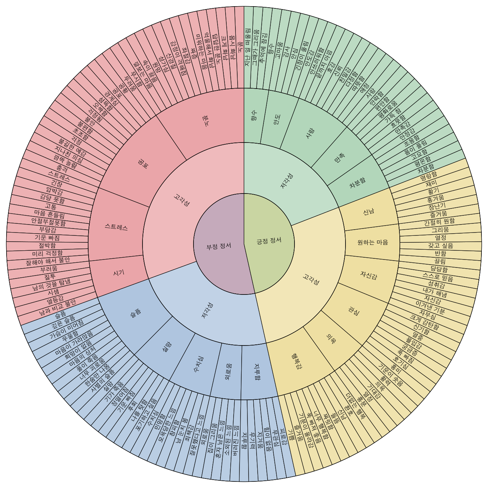

# 감정 휠 1 설명서

이 문서는 `korean_emotion_wheel_1`에 들어 있는 모든 감정을 한 줄씩 간단하지만 이해되게 설명합니다.

## 부정 정서 / 고각성

### 분노
- `분노`: 부당하거나 답답한 상황을 밀어내고 싶게 만드는 강한 화의 기본 감정입니다.
- `몹시 화남`: 참기 어려울 만큼 세게 치솟는 화입니다.
- `크게 화남`: 평소보다 훨씬 강하게 올라온 분노입니다.
- `답답한 분노`: 풀리지 않는 막힘 때문에 답답함과 함께 생기는 화입니다.
- `억울해서 화남`: 부당하게 대우받았다고 느낄 때 생기는 분노입니다.
- `미워하는 마음`: 상대를 밀어내고 싶을 만큼 싫어하는 감정입니다.
- `짜증`: 자잘한 불편이나 방해가 쌓여 올라오는 가벼운 화입니다.
- `좌절감`: 뜻대로 되지 않아 힘이 빠지고 화도 함께 나는 감정입니다.
- `감정이 격해짐`: 마음이 빨리 달아올라 반응이 거칠어지는 상태입니다.
- `신경질`: 예민해져 작은 자극에도 날카롭게 반응하는 화입니다.
- `성가심`: 번거롭고 귀찮아서 밀어내고 싶은 기분입니다.
- `원망`: 서운함과 화가 섞여 상대 탓을 하게 되는 감정입니다.
- `속이 끓음`: 화가 안으로 쌓여 몸과 마음이 뜨거워지는 느낌입니다.
- `깔보는 마음`: 상대를 낮게 보고 존중하지 않는 감정입니다.
- `무시함`: 상대를 중요하지 않게 여기며 밀어내는 태도 섞인 감정입니다.

### 공포
- `두려움`: 위험하거나 다칠 수 있다고 느낄 때 생기는 기본 공포입니다.
- `공황`: 갑자기 통제하기 어려울 만큼 크게 몰려오는 공포입니다.
- `공포`: 위협이 분명하다고 느껴 몸과 마음이 얼어붙는 두려움입니다.
- `경계심`: 나쁜 일이 생길까 봐 계속 살피고 조심하는 마음입니다.
- `섬뜩함`: 불길하고 차가운 두려움이 등골을 타고 오르는 느낌입니다.
- `오싹함`: 순간적으로 몸이 움츠러들 만큼 소름 끼치는 두려움입니다.
- `걱정됨`: 문제가 생길까 봐 마음이 편하지 않은 상태입니다.
- `불안`: 이유가 분명하지 않아도 계속 흔들리고 조마조마한 감정입니다.
- `불편함`: 상황이 안전하지 않거나 어색하다고 느껴 마음이 꺼려지는 상태입니다.
- `초조함`: 기다리기 어렵고 마음이 조급하게 흔들리는 불안입니다.
- `걱정`: 나쁜 결과를 떠올리며 계속 마음을 쓰는 감정입니다.
- `불길한 예감`: 아직 일어나지 않았지만 나쁜 일이 올 것 같은 느낌입니다.
- `지나친 의심`: 상대나 상황을 쉽게 믿지 못하고 계속 의심하는 마음입니다.
- `깜짝 놀람`: 예상 못 한 자극에 순간적으로 크게 움찔하는 반응입니다.
- `충격`: 갑작스럽고 큰 사건 때문에 마음이 멍해지는 강한 놀람입니다.

### 스트레스
- `스트레스`: 해야 할 일이나 압박이 많아 몸과 마음이 지치는 상태입니다.
- `긴장`: 실수하거나 문제가 생길까 봐 몸과 마음이 조여드는 느낌입니다.
- `압박감`: 책임이나 기대가 크게 눌러오는 부담입니다.
- `감당 못함`: 지금 상황이 내 힘보다 커서 버겁다고 느끼는 상태입니다.
- `고통`: 마음이나 몸이 아프고 견디기 힘든 괴로움입니다.
- `마음 흔들림`: 평소처럼 안정되지 않고 쉽게 동요하는 상태입니다.
- `안절부절못함`: 가만히 있기 어려울 만큼 불안하고 들뜬 상태입니다.
- `부담감`: 맡은 일이나 관계가 무겁게 느껴지는 마음입니다.
- `기운 빠짐`: 스트레스가 오래가 힘이 줄고 지치는 느낌입니다.
- `절박함`: 지금 당장 해결해야 할 것처럼 몰리는 마음입니다.
- `미리 걱정함`: 아직 일어나지 않은 일을 앞당겨 두려워하는 상태입니다.
- `잘해야 해서 불안`: 실수하면 안 된다는 압박 때문에 생기는 불안입니다.

### 시기
- `부러움`: 남이 가진 좋은 것을 나도 가지고 싶어지는 마음입니다.
- `질투`: 비교나 관계 속에서 빼앗길까 봐 예민해지는 감정입니다.
- `남의 것을 탐냄`: 다른 사람의 것까지 갖고 싶어지는 강한 욕구입니다.
- `시샘`: 남이 잘되는 것이 불편해 살짝 미워지는 마음입니다.
- `열등감`: 내가 남보다 부족하다고 느껴 위축되는 감정입니다.
- `남과 비교 불안`: 비교 속에서 뒤처질까 봐 흔들리는 불안입니다.

## 부정 정서 / 저각성

### 슬픔
- `슬픔`: 상실이나 상처 때문에 마음이 무거워지는 기본 감정입니다.
- `깊은 슬픔`: 쉽게 가라앉지 않을 만큼 크게 내려앉은 슬픔입니다.
- `가슴이 미어짐`: 마음이 찢어지는 듯 아픈 강한 슬픔입니다.
- `우울함`: 기운이 없고 세상이 어둡게 느껴지는 상태입니다.
- `마음이 가라앉음`: 평소보다 힘이 없고 의욕이 내려가는 느낌입니다.
- `희망이 없음`: 앞으로 나아질 것 같지 않아 마음이 꺼지는 상태입니다.
- `마음의 상처`: 누군가의 말이나 사건 때문에 오래 남는 아픔입니다.
- `풀이 죽음`: 기세가 꺾이고 마음이 축 처지는 상태입니다.
- `너무 괴로움`: 감당하기 힘들 만큼 마음이 아프고 답답한 상태입니다.
- `한숨만 나옴`: 마음이 무거워 자꾸 한숨이 나오는 상태입니다.
- `사별의 슬픔`: 사랑하던 사람을 잃었을 때의 깊은 슬픔입니다.

### 실망
- `실망`: 기대했던 것과 달라 마음이 내려앉는 감정입니다.
- `기가 죽음`: 자신감이 떨어지고 기세가 꺾이는 상태입니다.
- `정떨어짐`: 좋게 보던 대상에 마음이 식는 느낌입니다.
- `기운 빠짐`: 결과가 좋지 않아 힘이 쭉 빠지는 상태입니다.
- `후회`: 다른 선택을 했으면 좋았겠다고 되돌아보는 아픔입니다.
- `나를 탓함`: 좋지 않은 결과를 자기 책임으로 돌리며 괴로워하는 마음입니다.
- `포기하고 싶음`: 더 버티기 어렵고 그만두고 싶은 상태입니다.

### 수치심
- `수치심`: 내 모습이 드러나 숨고 싶어지는 아픈 감정입니다.
- `민망함`: 어색하고 부끄러워 몸 둘 바를 모르는 느낌입니다.
- `모욕당한 느낌`: 존중받지 못하고 깎였다고 느끼는 감정입니다.
- `창피함`: 실수나 노출 때문에 얼굴이 화끈거리는 부끄러움입니다.
- `남 눈치 봄`: 다른 사람 시선이 신경 쓰여 자유롭게 못하는 상태입니다.
- `죄책감`: 내가 잘못했다는 생각 때문에 마음이 무거워지는 감정입니다.
- `잘못했다고 느낌`: 내 행동을 돌아보며 고치고 싶어지는 마음입니다.

### 외로움
- `외로움`: 함께 있어 줄 사람이 없다고 느끼는 아픈 공허함입니다.
- `집이 그리움`: 익숙한 장소나 사람을 떠올리며 그리워하는 마음입니다.
- `혼자 남은 느낌`: 연결이 끊기고 홀로 남겨진 듯한 감정입니다.
- `소외된 느낌`: 집단이나 관계에서 끼지 못했다고 느끼는 상태입니다.
- `버려진 느낌`: 누군가에게 선택받지 못하고 놓여졌다고 느끼는 감정입니다.

### 지루함
- `지루함`: 자극이 부족해 시간이 길게 느껴지는 상태입니다.
- `무기력`: 하고 싶은 마음도 움직일 힘도 잘 나지 않는 상태입니다.
- `지겨움`: 같은 상황이 반복돼 싫증이 나는 느낌입니다.
- `힘이 없음`: 몸과 마음의 에너지가 떨어져 축 처진 상태입니다.
- `무관심`: 무엇을 보아도 별로 끌리거나 중요하게 느껴지지 않는 상태입니다.
- `피로감`: 계속된 소모로 몸과 마음이 지친 느낌입니다.

## 긍정 정서 / 고각성

### 행복감
- `기쁨`: 좋은 일이 생겼을 때 마음이 환해지는 기본 감정입니다.
- `즐거움`: 현재의 경험이 재미있고 기분 좋게 느껴지는 상태입니다.
- `기분이 올라감`: 마음이 한층 밝고 가벼워지는 느낌입니다.
- `푹 빠져 좋음`: 무언가에 깊이 빠져 큰 만족을 느끼는 상태입니다.
- `너무 행복함`: 더 바랄 것 없을 만큼 기분이 좋은 상태입니다.
- `짜릿함`: 순간적으로 강한 즐거움이 몸을 스치는 느낌입니다.
- `들뜸`: 좋은 일을 앞두고 마음이 붕 뜨는 상태입니다.
- `신남`: 에너지가 올라가서 몸과 마음이 같이 즐거운 상태입니다.
- `환호`: 기쁨이 커서 밖으로 크게 터져 나오는 반응입니다.
- `더없는 행복`: 부족함 없이 꽉 찬 행복감입니다.

### 의욕
- `흥분`: 좋은 자극 때문에 몸과 마음이 크게 들뜨는 상태입니다.
- `열정`: 하고 싶은 마음이 강하고 오래 타오르는 에너지입니다.
- `기대감`: 앞으로 올 좋은 일을 떠올리며 부푸는 마음입니다.
- `의욕`: 무언가를 해내고 싶어 움직이게 되는 힘입니다.
- `활력`: 몸과 마음에 생기가 돌아 힘이 나는 상태입니다.
- `기운이 솟음`: 에너지가 새로 생겨 바로 움직이고 싶어지는 느낌입니다.

### 관심
- `흥미`: 어떤 대상이 눈길을 끌고 더 알고 싶어지는 감정입니다.
- `호기심`: 이유나 내용을 알고 싶어 질문이 생기는 마음입니다.
- `푹 빠짐`: 대상에 깊게 집중해 다른 것이 잘 안 보이는 상태입니다.
- `궁금증`: 알지 못하는 것을 확인하고 싶은 마음입니다.
- `몰입감`: 하는 일에 깊이 들어가 시간이 잘 안 느껴지는 상태입니다.
- `열중`: 하나에 정신을 모아 집중하는 상태입니다.
- `신기함`: 새롭거나 낯선 것이 재미있게 다가오는 느낌입니다.
- `크게 감탄함`: 예상보다 훨씬 인상적이라 놀라며 감탄하는 마음입니다.

### 자신감
- `자부심`: 스스로나 자신이 속한 대상이 자랑스럽게 느껴지는 감정입니다.
- `이겨낸 기분`: 어려움을 넘겨서 뿌듯하고 강해진 느낌입니다.
- `자신감`: 내가 해낼 수 있다고 믿는 안정된 마음입니다.
- `내가 해냄`: 노력한 결과를 직접 이루었다고 느끼는 상태입니다.
- `성취감`: 목표에 도달했을 때 차오르는 만족과 뿌듯함입니다.
- `스스로 믿음`: 바깥 평가보다 내 힘을 먼저 믿는 태도입니다.
- `당당함`: 위축되지 않고 떳떳하게 서 있는 느낌입니다.

### 원하는 마음
- `끌림`: 사람이나 대상 쪽으로 마음이 자연스럽게 향하는 감정입니다.
- `반함`: 강하게 마음을 빼앗겨 좋다고 느끼는 상태입니다.
- `갖고 싶음`: 어떤 대상이나 관계를 내 것으로 두고 싶은 마음입니다.
- `열정`: 좋아하는 대상에 에너지를 많이 쏟고 싶은 상태입니다.
- `그리움`: 멀어졌거나 없는 대상을 마음으로 계속 찾는 감정입니다.
- `간절히 원함`: 꼭 이루고 싶어 마음이 세게 쏠리는 상태입니다.

### 신남
- `즐거움`: 가볍고 밝게 웃고 싶어지는 기본적인 재미의 감정입니다.
- `장난기`: 웃고 놀며 가볍게 반응하고 싶은 마음입니다.
- `흥겨움`: 분위기에 몸과 마음이 함께 들썩이는 즐거움입니다.
- `활기`: 생기가 돌아 움직임이 자연스럽게 커지는 상태입니다.
- `재미`: 몰입해서 웃거나 즐기게 되는 가벼운 기쁨입니다.
- `명랑함`: 밝고 산뜻한 기분이 오래 이어지는 상태입니다.

## 긍정 정서 / 저각성

### 차분함
- `차분함`: 감정이 크게 출렁이지 않고 안정된 상태입니다.
- `평온함`: 마음이 잔잔하고 방해받지 않는 평화로운 상태입니다.
- `고요함`: 움직임과 소란이 줄어 조용히 가라앉은 상태입니다.
- `몸이 풀림`: 긴장이 풀리며 몸과 마음이 함께 이완되는 느낌입니다.
- `조용함`: 자극이 적어 생각과 감정이 잔잔해지는 상태입니다.
- `안정감`: 흔들리지 않고 괜찮다고 느끼는 든든한 감각입니다.

### 만족
- `만족감`: 현재 상태가 꽤 괜찮다고 느끼는 긍정적 감정입니다.
- `흐뭇함`: 조용하지만 분명하게 차오르는 뿌듯한 즐거움입니다.
- `가득 참`: 부족함보다 채워짐이 크게 느껴지는 상태입니다.
- `평화로움`: 다툼이나 긴장 없이 편안하게 이어지는 상태입니다.
- `편안함`: 몸과 마음이 무리 없이 쉬는 느낌입니다.
- `안락함`: 안전하고 포근해서 오래 머물고 싶은 상태입니다.

### 사랑
- `사랑`: 깊이 아끼고 지켜주고 싶은 마음이 큰 감정입니다.
- `애정`: 부드럽고 따뜻하게 향하는 호감과 애착입니다.
- `따뜻함`: 상대를 편안하게 감싸고 싶은 마음의 온기입니다.
- `다정함`: 친절하고 부드럽게 대해 주고 싶은 마음입니다.
- `친밀감`: 서로 가까이 연결되어 있다고 느끼는 감정입니다.
- `신뢰`: 상대를 믿고 마음을 놓을 수 있는 상태입니다.
- `호감`: 자연스럽게 좋게 느껴져 더 가까워지고 싶은 마음입니다.
- `끝까지 아낌`: 쉽게 놓지 않고 오래 돌보고 싶은 마음입니다.
- `안쓰러워함`: 상대의 힘듦을 보고 도와주고 싶어지는 연민입니다.

### 안도
- `안도감`: 걱정이 줄어들며 한숨 놓게 되는 감정입니다.
- `긴장이 풀림`: 몸과 마음을 조이던 힘이 내려가는 상태입니다.
- `안심`: 당장 큰 문제가 없다고 느껴 마음이 놓이는 상태입니다.
- `감사`: 좋은 것을 받았거나 도움을 받아 고맙게 느끼는 감정입니다.
- `고마움`: 누군가의 마음이나 행동을 따뜻하게 받아들이는 느낌입니다.

### 향수
- `향수`: 지나간 시간이나 장면을 떠올리며 그리워하는 감정입니다.
- `추억에 잠김`: 옛 장면을 떠올리며 마음이 오래 머무는 상태입니다.
- `그때가 그리움`: 지나간 시절 자체를 다시 만나고 싶은 마음입니다.
- `지난 일 떠올림`: 예전 경험을 되짚으며 감정이 따라오는 상태입니다.
